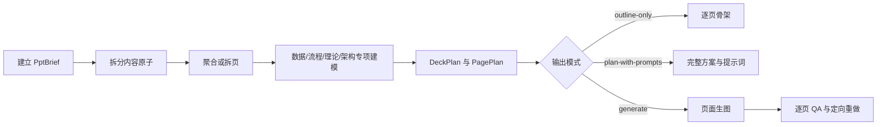

<div align="center">


# PPT Page Image Director

**把已有内容组织成高信息密度、低理解负担的 PPT 页面方案与页面图片**

[](LICENSE)

</div>

> **定位**：面向课程、培训、咨询、汇报和销售演示的 PPT 页面图片规划与生成 Skill。<br>
> **不做什么**：不交付可编辑 PPTX，不把所有内容机械拆成低密度页面，也不承诺图像模型能像素级复现 Logo 或小字号文字。

## 导航

- [为什么需要它](#为什么需要它)
- [快速开始](#快速开始)
- [工作原理](#工作原理)
- [核心能力](#核心能力)
- [输入与输出](#输入与输出)
- [隐私、品牌与边界](#隐私品牌与边界)

## 为什么需要它

很多 PPT 生成流程默认“一页一个信息点”，容易把完整的方法论、能力模型、流程或架构拆散；另一种极端则是把文字直接堆满页面。

本 Skill 先分析内容之间的并列、顺序、包含、依赖、因果、比较、转化和循环关系，再决定哪些内容应该聚合、哪些应该拆页，以及使用什么页面结构。核心原则是：

> 一页一个核心问题，不等于一页只有一个信息点。

## 快速开始

### 1. 安装

将仓库克隆到 Codex Skills 目录：

```bash
git clone https://github.com/OWENWANG-GULIAI/ppt-page-image-director.git ~/.codex/skills/ppt-page-image-director
```

在新的 Codex 任务中即可通过名称调用。若你的 Skill 根目录不同，请将仓库放入对应的 Skills 目录。

### 2. 调用示例

```text
使用 $ppt-page-image-director，把这份课程内容整理成 12 页 PPT 页面方案。
其中能力体系、流程和架构尽量用完整的一页表达；先只输出 plan-only 方案，不实际生图。
```

需要实际页面图片时：

```text
使用 $ppt-page-image-director，基于已确认的逐页方案生成全部 16:9 页面图片，并逐页检查事实、文字、裁切和品牌一致性。
```

## 工作原理



## 核心能力

- **关系驱动的页边界**：按照认知闭环聚合内容，不用固定字数或固定层数决定拆页。
- **三档页面密度**：区分低、中、高密度；完整能力模型、架构和角色流程可以集中在一页。
- **专业内容分型**：数据、流程、理论、架构、案例和行动分别建模。
- **结构图选择**：覆盖并列、流程、时间、层级、循环、比较、分析、转化和战略等常用关系。
- **事实与推导边界**：区分 `Exact`、`Optimizable`、`Derived` 和 `Unknown`，保留数字、单位、年份与专有名词原字符串。
- **多种输出模式**：支持 `outline-only`、`plan-with-prompts`、指定页生图和全部生图。
- **GULIAI 品牌预设**：按页面背景自动选择明暗 Logo；需要精确品牌时使用官方 PNG 确定性叠加。
- **质量门槛**：检查事实、文字、裁切、结构语义、数据口径、品牌和跨页一致性；每页最多两次针对性重做。

## 适用场景

- 课程与培训 PPT；
- 咨询方案、项目汇报和销售演示；
- 能力地图、方法论和理论模型；
- 数据仪表盘、角色流程和系统架构；
- GULIAI 品牌的静态 PPT 页面方案或页面图片。

## 示例

> 以下为虚构示例，不包含真实个人、客户或私聊信息。

输入：

```text
把“客户成功运营体系”整理成一页总览：
客户分层 → 健康监测 → 运营动作，组织保障横向支撑全链路。
每个模块包含三个短语级子项，只输出方案。
```

预期规划：

- 保留为一张高密度总览页；
- 主结构选择横向流程；
- 组织保障使用全宽支撑带，不画成第四个流程步骤；
- 不补造健康阈值、触发规则、角色职责或结果数据；
- 若后续加入详细规则，保留总览并增加放大页。

## 输入与输出

| 类型 | 内容 |
|---|---|
| 输入 | 原始文章、课程材料、汇报内容、逐页草稿、品牌要求、Logo 或参考图 |
| 方案输出 | 总叙事、内容覆盖、逐页 `PagePlan`、页面文案、结构选择、素材计划与提示词 |
| 生图输出 | 16:9 静态页面图片、逐页 QA 结果、定向重做记录与已知限制 |

## 仓库结构

- [`SKILL.md`](SKILL.md)：Skill 入口、核心原则和参考路由
- [`references/`](references/)：需求契约、内容分解、结构选择、页面规划、品牌和质量规则
- [`assets/`](assets/)：GULIAI 明暗背景 Logo 资产
- [`agents/openai.yaml`](agents/openai.yaml)：Skill 展示与默认调用提示
- [`tests/`](tests/)：结构、可移植性和公开发布检查
- [`evals/scenarios.md`](evals/scenarios.md)：行为回归场景
- [`BRAND-ASSETS.md`](BRAND-ASSETS.md)：品牌资产使用边界

## 质量保证

运行仓库测试：

```bash
node --test tests/skill.test.mjs
```

本仓库还使用 Codex Skill 官方校验器检查 YAML frontmatter、名称与目录结构。测试不会证明生成图片的视觉质量；实际生图仍需执行逐页 QA。

## 隐私、品牌与边界

- 只使用用户提供、授权或明确允许公开的材料。
- 不根据空缺补造人物、客户、日期、数据、Logo、二维码或案例。
- 示例应使用虚构或充分匿名化数据。
- 静态页面图片不等于可编辑 PPTX。
- 图像模型不保证 Logo、长文本和小字号的像素级准确；品牌精确时使用官方资产后期叠加。
- GULIAI 名称与 Logo 的使用边界见 [`BRAND-ASSETS.md`](BRAND-ASSETS.md)。

## 当前版本边界

- 当前交付目标是逐页方案和静态 PPT 页面图片，不生成可编辑 PPTX。
- 实际生图依赖运行环境提供的 `imagegen` 能力；只安装本仓库并不会附带独立图像生成服务。
- 仓库测试验证结构、链接、可移植性和品牌边界，不替代实际生成页面的视觉 QA。
- 结构容量是规划预警线，不是可以绕过可读性检查的固定配额。

## 参与贡献

欢迎提交 Issue 或 Pull Request。复现问题时请使用虚构或匿名化内容，不要上传私人聊天、客户材料、内部数据、凭证或未授权品牌资产。

## 许可证

代码与文档采用 [MIT License](LICENSE)。GULIAI 名称、标识和 Logo 不包含在 MIT 商标授权中，详见 [`BRAND-ASSETS.md`](BRAND-ASSETS.md)。

---

让页面密度服从内容关系，让完整主题保持完整。
